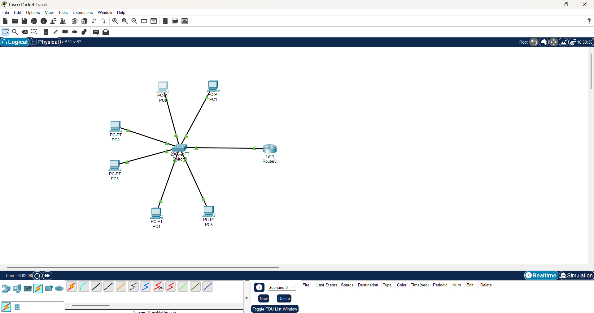
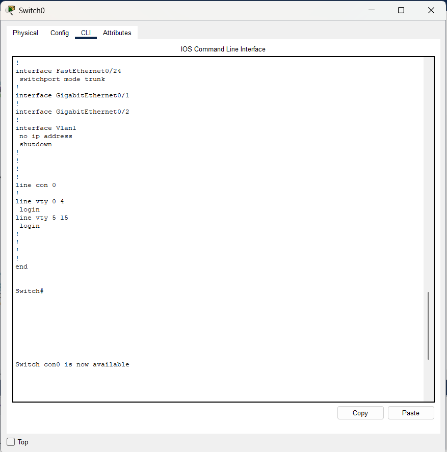
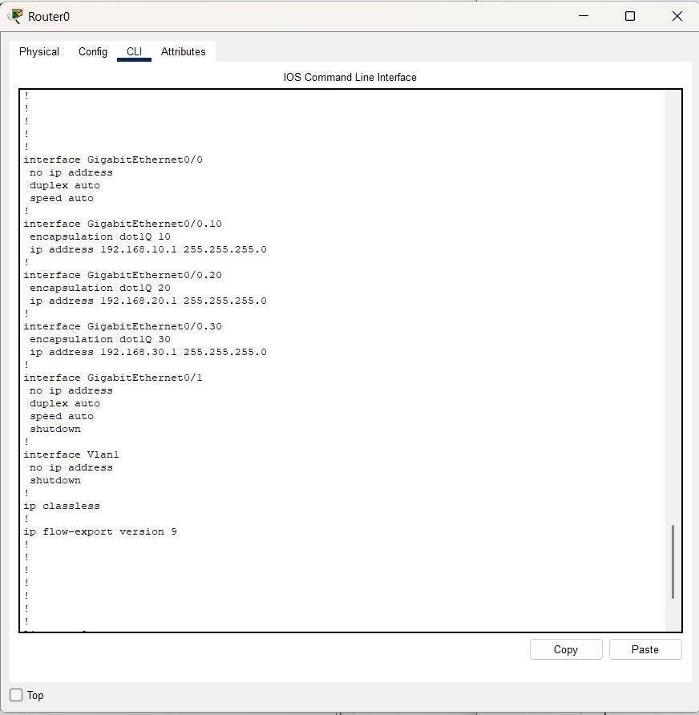
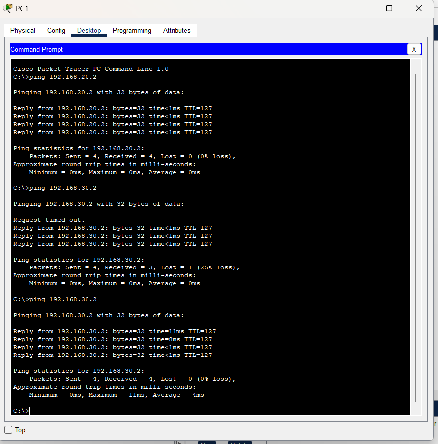

# 🔌 Small Business VLAN Network Project

## 📌 Overview
This project simulates a small business network using VLAN segmentation and inter-VLAN routing.

---

## 🧠 Key Concepts
- VLAN configuration (HR, Sales, IT)
- Switch port assignment
- Trunk configuration
- Router-on-a-stick (Inter-VLAN routing)
- IP addressing and subnetting

---

## 🏗️ Network Design
- VLAN 10: HR Department  
- VLAN 20: Sales Department  
- VLAN 30: IT Department  

---

## ✅ Features
- Secure network segmentation using VLANs  
- Communication between departments via router  
- Fully working inter-VLAN routing  
- Successful connectivity testing (0% packet loss)  

---

## 📂 Project Files

- 📥 **Packet Tracer Lab File**  
  👉 [Download Here](Small_Business_Network.pkt)

> Open using Cisco Packet Tracer to view and test the full network configuration.

---

## 📸 Network Evidence

### 🏗️ Full Network Topology

---

### 🔀 Switch TRUNK Configuration

---

### 🌐 Router Configuration

---

### 🧪 Connectivity Test (Ping Success)

---

## 🚀 What I Learned
- How to design a structured network using VLANs  
- How to configure trunk links between switch and router  
- How to enable communication between VLANs using a router  
- How to troubleshoot connectivity issues in a network  

---

## ⚡ Future Improvements
- Add DHCP for automatic IP assignment  
- Implement ACLs for network security  
- Simulate internet connectivity  
